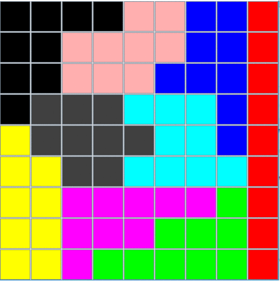
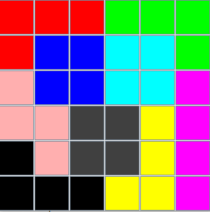
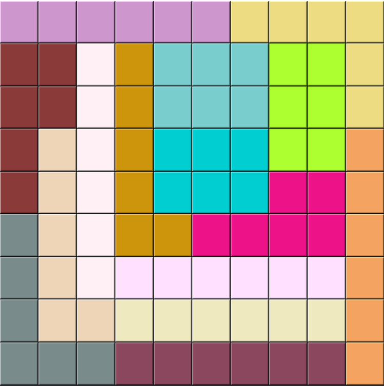

# Divide Board into k groups

Divide a board of size n x m  into k equal contiguous groups. The groups are randomly allocated every time.

## Examples

1.  A 9x9 board divided into 9 equal contiguous groups as demonstrated below 

2. A 6x6 board divided into 9 equal and contiguous groups as demonstrated below


## Solution

The problem can be easily solved using a Depth First Search. However, the constraint that all cells in a group need to be contiguous poses a challenge that randomly selecting a neighbouring cell can end up blocking cells at the corner.

To solve that, let's first assign degree to every cell of the board. Degree is the number of free neighbours a cell has. The lower the cell degree, the higher it's chances to be blocked.

```md
Degree of cells in a 4x4 board:

|2|3|3|2|
|3|4|4|2|
|3|4|4|2|
|2|3|3|2|
```

One approach to achieve a sure-shot solution is to ensure that the cell being assigned always has the lowest degree i.e. 2.  An algorith would look as follows:

1. Start from any corner since they have the lowest degree on the entire board.
2. Assign a group to the current cell and mark it as assigned.
3. Decrease degree of neighbouring cells by 1.
4. Select the next neighbour with the lowest degree i.e. 2
5. Repeat 1-3 until all cells are assigned.


## Code

The entrypoint of the code is located at `src/python/board.py`. Below is a code snippet to execute it.

```python3
nrows = 9
ncols = 10
ngroups = 15

b = Board(nrows, ncols)  # initialize the board
b.divide_board(ngroups)  # main algorithm
b.display_board()		 # display gui of divided board
```

Example output:

A 9x10 board divided into 15 groups.
